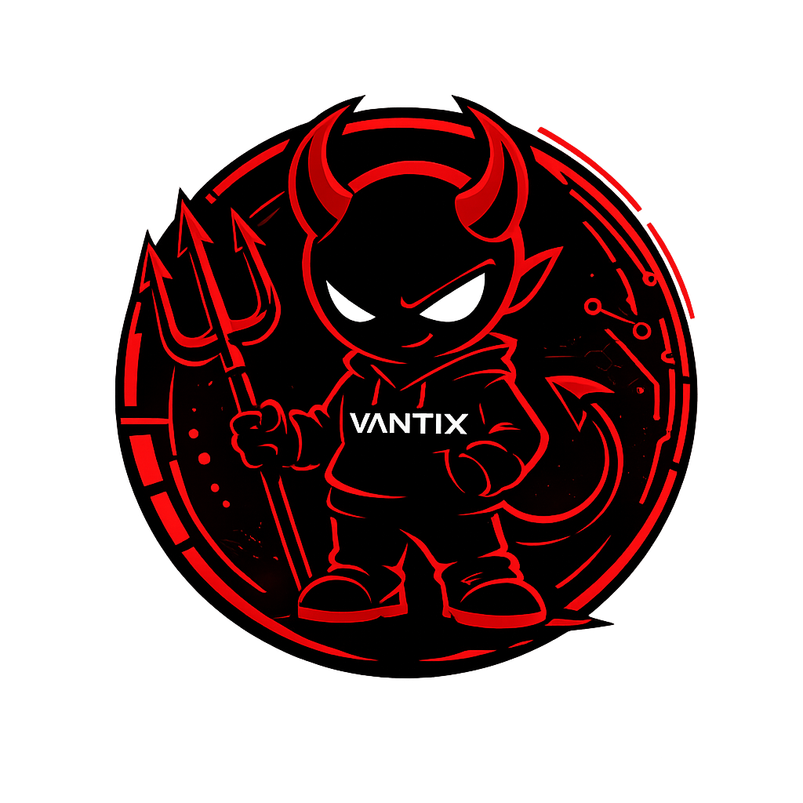
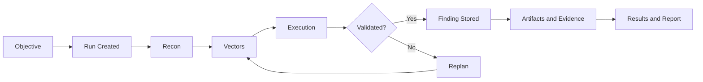

<p align="center">
  
</p>

<h1 align="center">VANTIX</h1>

<p align="center">
  <strong>Autonomous Offensive Security Framework</strong><br>
  Chat-first control plane for pentest, bug bounty, CTF, KOTH, and long-horizon agent campaigns.
</p>

<p align="center">
  
  
  
  
  
</p>

<p align="center">
  
</p>

---

## Table of Contents

- [What is VANTIX?](#what-is-vantix)
- [Why VANTIX is different](#why-vantix-is-different)
- [Core capabilities](#core-capabilities)
- [Architecture](#architecture)
- [Specialist roles](#specialist-roles)
- [How a run works](#how-a-run-works)
- [Supported modes](#supported-modes)
- [UI model](#ui-model)
- [Quick start](#quick-start)
- [Operational workflow](#operational-workflow)
- [API highlights](#api-highlights)
- [Runtime and storage](#runtime-and-storage)
- [Benchmarking direction](#benchmarking-direction)
- [Repo layout](#repo-layout)
- [Roadmap](#roadmap)
- [Contributing](#contributing)
- [Authorized use only](#authorized-use-only)

---

## What is VANTIX?

VANTIX is an autonomous offensive security framework built for **authorized security testing**.

It is designed as a **chat-first offensive security control plane** that combines:

- a FastAPI backend
- a React/Vite frontend
- durable run state
- specialist agent roles
- vector selection
- attack-chain modeling
- handoffs
- approvals
- memory and CVE context
- evidence and reporting workflows

VANTIX is not built as a one-shot scanner or a thin prompt wrapper.

It is built around **stateful campaigns** that can be created, continued, reviewed, paused, resumed, and reported through the same control plane.

### Primary use cases

- **Autonomous pentesting** for authorized targets
- **Bug bounty-style research** and vector discovery
- **CTF** and **KOTH** workflows
- **Security research** with reusable memory and handoff state
- **Operator-led engagements** where a human steers while specialists execute

---

## Why VANTIX is different

Most AI security projects expose a single agent and a tool list.

VANTIX is structured around **campaign execution**.

That changes the shape of the system:

| Area | Typical AI security wrapper | VANTIX |
| --- | --- | --- |
| Run model | Single prompt / single session | Durable run with persistent state |
| Operator control | Minimal | Chat guidance, approvals, vector review |
| Agent strategy | One generalist | Multiple specialist roles |
| Workflow model | Best-effort loop | Phases, retries, checkpoints, replan |
| Evidence model | Ad hoc logs | Findings, artifacts, results, reports |
| Continuity | Session-local | Dense memory and machine-readable handoffs |
| Product shell | CLI only or raw backend | UI + API control plane |

### The core design principle

VANTIX treats an assessment as a **living run**.

A run can:

1. accept a scoped objective
2. spawn specialist work
3. gather facts
4. generate candidate vectors
5. execute under controls
6. replan when blocked
7. preserve results and handoff state
8. produce report-ready output

---

## Core capabilities

### Chat-first orchestration

The main entrypoint is an orchestrator chat. A message can create a new run or continue an existing one.

### Durable workflow execution

Runs are tracked with phase data, workflow execution records, retries, checkpoints, and worker leases.

### Specialist scheduling

The scheduler seeds tasks, roles, vectors, and notes instead of pushing everything into a single agent context.

### Skill-pack selection

Compact skill packs are selected by role, mode, and run context, then written into the runtime for agent use.

### Vector review and selection

Candidate vectors are stored as first-class objects, can be manually inserted, and can be selected to trigger replanning.

### Handoffs and machine-readable continuity

Runs expose dense handoff state that another agent or session can consume directly.

### Evidence-backed results

Findings, artifacts, vectors, terminal summaries, and report paths are exposed through both the UI and API.

### Local CVE and intelligence context

VANTIX includes a local CVE and vulnerability-intel workflow, with optional MCP exposure.

### User-owned runtime storage

Runtime state defaults to a per-user local path rather than requiring root-owned shared storage.

---

## Architecture

<p align="center">
  
</p>

### Architectural model

VANTIX is split into a few clear layers:

#### 1. Product shell
The frontend is a React/Vite application that centers the operator around:
- orchestrator chat
- active run context
- specialist timeline
- terminal stream
- vectors
- memory
- CVE intel
- approvals
- results
- runtime settings

#### 2. Control plane
The backend exposes a FastAPI control plane with routers for:
- chat
- runs
- vectors
- skills
- handoffs
- attack chains
- results
- tools
- providers
- system status
- install status
- CVE endpoints

#### 3. Durable workflow layer
The workflow layer tracks execution state through:
- workflow executions
- phase runs
- checkpoints
- worker leases
- run metrics

This gives long-running work structure instead of relying on raw loop state.

#### 4. Worker runtime
A worker claims phases, executes them, and writes:
- completion
- retry
- blocked
- failure

That makes it possible to recover stale work and preserve execution progress.

#### 5. Safety and execution adapters
Execution is mediated through dispatching, policies, and reporting synthesis, rather than treating tool execution as an uncontrolled free-for-all.

---

## Specialist roles

VANTIX uses durable specialist records rather than pretending one agent should handle everything equally well.

| Role | Product name | Responsibility |
| --- | --- | --- |
| `orchestrator` | Vantix Orchestrator | normalize scope, decide phase transitions, write handoffs |
| `recon` | Vantix Recon | low-noise target discovery and service facts |
| `knowledge_base` | Knowledge Base | load memory, methods, prior cases, and tool notes |
| `vector_store` | Vector Store | rank candidate paths and similar prior work |
| `researcher` | Researcher | correlate CVE, exploit, and source intelligence |
| `developer` | Vantix Forge | build validation helpers and lab notes when evidence supports it |
| `executor` | Vantix Exploit | execute selected vectors through current controls |
| `reporter` | Vantix Report | findings, artifacts, evidence, summaries, and next actions |

### Why this matters

This structure makes VANTIX more useful for long-horizon work because:
- different responsibilities stay explicit
- handoffs are cleaner
- prompts stay shorter
- evidence can be attached to the right phase
- operator review becomes easier

---

## How a run works

<p align="center">
  
</p>

### Run lifecycle



### What actually happens

1. The operator enters an authorized objective in the UI or sends it to `POST /api/v1/chat`.
2. VANTIX creates or continues a run.
3. The scheduler seeds specialist tasks and initial vectors.
4. Skill packs are selected from role, mode, and run facts.
5. Prompts and state are written into the user-owned runtime path.
6. Agents produce observations, evidence, risk notes, next actions, blockers, and vectors.
7. Candidate vectors can be reviewed and selected.
8. Findings and artifacts accumulate into results.
9. Dense handoff state can be exported at any point.
10. A final report path is surfaced when reporting completes.

---

## Supported modes

The UI and scheduling model already reflect multiple operator modes.

| Mode | Purpose |
| --- | --- |
| `pentest` | authorized offensive security testing |
| `ctf` | challenge solving and exploit-path work |
| `koth` | attack/defend competitive operations |
| `bugbounty` | recon, validation, and finding development |
| `windows-ctf` | Windows-specific challenge workflows |
| `windows-koth` | Windows-specific adversarial workflows |

### Why the mode system matters

The point is not cosmetic labels.

Modes let VANTIX adapt:
- prompt selection
- skill packs
- operator expectations
- target assumptions
- reporting behavior
- workflow posture

---

## UI model

The UI is not decorative. It is the operator shell.

### Main panels

- **Run Sidebar** — recent runs and active run selection
- **Orchestrator Chat** — durable messages and run guidance
- **Agent Timeline** — task and agent-session status
- **Terminal** — live execution stream
- **Target** — target, mode, objective, scheduler status
- **Vectors** — candidate paths and manual insertion
- **Memory** — facts and learning hits
- **CVE Intel** — active target intelligence
- **Results** — findings, artifacts, report path, summary
- **Approvals** — pending operator decisions
- **Runtime Settings** — status, token, provider records

### Design philosophy

The UI is designed for:
- **reviewability**
- **operator intervention**
- **long-running work**
- **evidence-first navigation**

---

## Quick start

### Interactive installer

```bash
bash scripts/install-vantix.sh
```

The installer bootstraps:
- Python environment
- frontend dependencies
- `.env`
- runtime paths
- optional provider records
- local CVE/MCP deployment
- a selected host tool suite

### Update flow

```bash
bash scripts/update-vantix.sh --check
bash scripts/update-vantix.sh
bash scripts/update-vantix.sh --verify
```

### Manual bootstrap

```bash
python3 -m venv .venv
source .venv/bin/activate
python3 -m pip install --upgrade pip
python3 -m pip install -e ".[dev]"
cp .env.example .env
export SECOPS_API_TOKEN=dev
bash scripts/doctor.sh
bash scripts/secops-api.sh
```

### Frontend

```bash
cd frontend
corepack pnpm install
corepack pnpm dev
```

### Service control

```bash
systemctl --user status vantix-api.service vantix-ui.service
journalctl --user -u vantix-api.service -u vantix-ui.service -f
bash scripts/vantixctl.sh status
bash scripts/vantixctl.sh restart
```

---

## Operational workflow

### UI flow

1. Start the API and UI
2. Open the frontend
3. Enter an authorized objective
4. Review specialists, vectors, memory, CVE intel, and results
5. Select vectors only when evidence and scope are clear
6. Add operator notes when human guidance is needed
7. Review findings and artifacts before report handoff

### API-only flow

Create a run:

```bash
curl -s http://127.0.0.1:8787/api/v1/chat   -H 'Content-Type: application/json'   -d '{"message":"Full test of https://example.test","mode":"pentest"}'
```

Continue or replan a run:

```bash
curl -s http://127.0.0.1:8787/api/v1/chat   -H 'Content-Type: application/json'   -d '{"run_id":"<run_id>","message":"Prioritize low-noise web validation and refresh CVE context."}'
```

---

## API highlights

### Core entrypoints

```text
POST /api/v1/chat
GET  /api/v1/system/status
GET  /api/v1/system/install-status
```

### Run review

```text
GET /api/v1/runs/<run_id>/messages
GET /api/v1/runs/<run_id>/vectors
GET /api/v1/runs/<run_id>/results
GET /api/v1/runs/<run_id>/skills
GET /api/v1/runs/<run_id>/handoff
GET /api/v1/runs/<run_id>/graph
```

### Vector operations

```bash
curl -s http://127.0.0.1:8787/api/v1/runs/<run_id>/vectors   -H 'Content-Type: application/json'   -d '{"title":"Manual validation path","summary":"operator supplied","confidence":0.8,"next_action":"validate safely"}'
```

Select a vector:

```bash
curl -s -X POST http://127.0.0.1:8787/api/v1/runs/<run_id>/vectors/<vector_id>/select
```

### Skill-pack operations

```bash
curl -s http://127.0.0.1:8787/api/v1/skills
curl -s http://127.0.0.1:8787/api/v1/runs/<run_id>/skills
curl -s -X POST http://127.0.0.1:8787/api/v1/runs/<run_id>/skills/apply
```

### Attack-chain operations

```bash
curl -s http://127.0.0.1:8787/api/v1/runs/<run_id>/attack-chains   -H 'Content-Type: application/json'   -d '{"name":"Recon to validated finding","score":70,"steps":[{"phase":"recon"},{"phase":"validate"}],"notes":"Evidence-backed candidate path."}'
```

---

## Runtime and storage

VANTIX defaults to a **user-owned runtime root**:

```text
${XDG_STATE_HOME:-$HOME/.local/state}/ctf-security-ops/<repo-name>-<repo-hash>
```

That helps avoid:
- SQLite locking issues on shared mounts
- root-owned runtime drift
- fragile assumptions about NFS or privileged storage

### Important variables

| Variable | Purpose |
| --- | --- |
| `SECOPS_REPO_ROOT` | project root |
| `SECOPS_RUNTIME_ROOT` | user-owned runtime data |
| `SECOPS_REPORTS_ROOT` | reports and artifact root |
| `SECOPS_SHARED_ROOT` | optional shared storage root |
| `VANTIX_SKILLS_ROOT` | override for repo-local skill packs |
| `SECOPS_API_TOKEN` | bearer token for protected routes |
| `VANTIX_SECRET_KEY` | encryption key for optional provider secrets |
| `SECOPS_CODEX_BIN` | Codex CLI binary path or name |

---

## Benchmarking direction

VANTIX is best positioned as:

- **A: primary** — an open-source autonomous pentest framework
- **D: broader vision** — an offensive security operating platform that also supports bug bounty, CTF, KOTH, and research ops

### Evaluation model

A serious benchmark story for VANTIX should include all three modes:

| Mode | Inputs |
| --- | --- |
| Black-box | target URL / IP only |
| Gray-box | target + standard user credentials |
| White-box | target + source / repo context |

### Candidate targets

- OWASP Juice Shop
- OWASP crAPI
- c{api}tal API
- custom internal labs
- modified benchmark forks to reduce overfitting

### What should be measured

- validated findings
- exploit success rate
- false positives
- time to first valid finding
- endpoint / route coverage
- severity-weighted score
- evidence completeness
- operator review quality

For a longer benchmark plan, see [docs/BENCHMARKS.md](./docs/BENCHMARKS.md).

---

## Repo layout

```text
.
├── frontend/                 # React + Vite operator UI
├── docs/                     # architecture, agents, API, install, memory, orchestration
├── scripts/                  # installer, updater, runtime control, doctor, CVE helpers
├── agent_skills/             # compact skill packs by role and mode
├── tests/                    # test suite
├── pyproject.toml            # Python package and dependencies
└── README.md
```

---

## Roadmap

### Product
- benchmark harness for black-box / gray-box / white-box runs
- stronger benchmark reporting and scorecards
- richer evidence navigation in the UI
- more visual run analytics and campaign summaries
- browser-assisted workflows where appropriate

### Platform
- more distributed worker execution options
- better CI and release workflows
- deeper service health / observability surfaces
- stronger packaging for self-hosted deployments

### Operator workflow
- improved report templates
- benchmark comparison output
- team collaboration primitives
- better guided review for approvals and findings

---

## Contributing

Contributions are welcome.

The most useful contributions are usually one of these:

- bug fixes
- architecture cleanup
- runtime reliability work
- benchmark harness improvements
- documentation upgrades
- test coverage
- better UI review flows
- safer execution controls

### Good issue reports include

- environment details
- reproduction steps
- expected behavior
- actual behavior
- logs or screenshots when relevant

---

## Authorized use only

VANTIX is for **systems you own or are explicitly authorized to test**.

Do not use it against:
- third-party targets without permission
- production systems outside approved scope
- environments that prohibit autonomous security testing

Keep these out of committed files:
- `.env`
- provider keys
- real client data
- production credentials
- private topology
- SSH keys
- target evidence that should remain local

---

## Further reading

- [docs/ARCHITECTURE.md](./docs/ARCHITECTURE.md)
- [docs/QUICKSTART.md](./docs/QUICKSTART.md)
- [docs/BENCHMARKS.md](./docs/BENCHMARKS.md)

---

<p align="center">
  Built by <strong>the-vibe-dev</strong>
</p>
