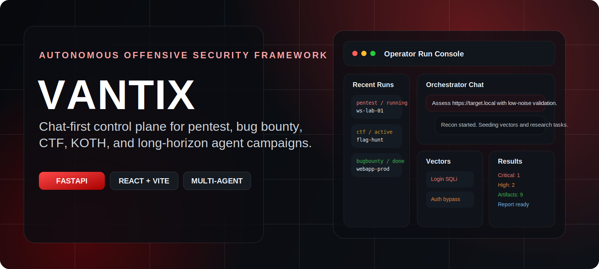
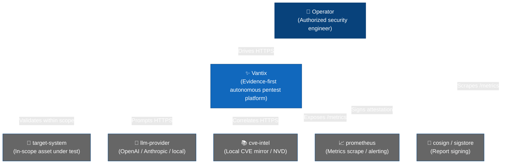
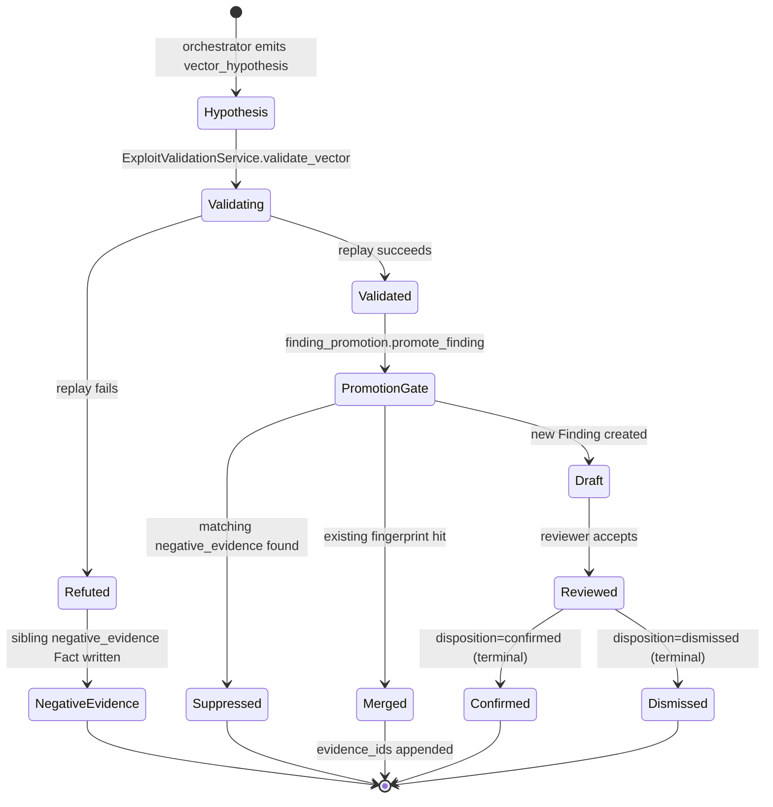
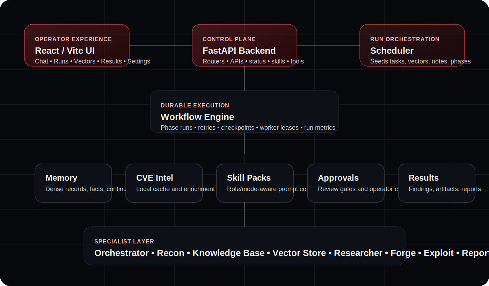
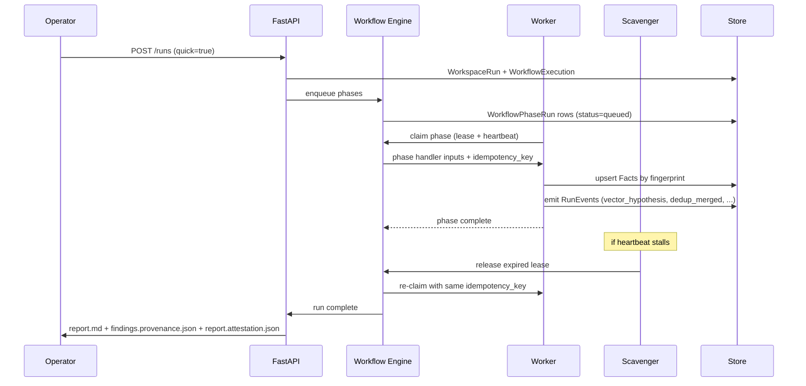

# VANTIX

<div align="center">
  
</div>

<div align="center" style="font-size: 1.3em; margin: 20px 0;">
  <strong>V</strong>erifiable <strong>A</strong>utonomous e<strong>N</strong>gagement <strong>T</strong>esting &amp; e<strong>X</strong>ecution
</div>
<br>
<div align="center">

> **Evidence-first autonomous pentesting.** Vantix is the operator control plane for autonomous security testing agents — durable run orchestration, specialist agents, browser/runtime evidence, policy gates, approvals, cryptographic chain-of-custody, and signed reports — all local-first.

</div>

## Table of Contents

- [Overview](#overview)
- [What This Product Does](#what-this-product-does)
- [Example Outcomes](#example-outcomes)
- [Black-Box And White-Box Testing](#black-box-and-white-box-testing)
- [Public Case Studies](#public-case-studies)
- [OWASP Juice Shop Benchmark Example](#owasp-juice-shop-benchmark-example)
- [Features](#features)
- [What's New](#whats-new)
- [Architecture](#architecture)
  - [System Context](#system-context)
  - [Evidence Pipeline](#evidence-pipeline)
  - [Workflow Engine](#workflow-engine)
  - [Finding Lifecycle](#finding-lifecycle)
- [Quick Start](#quick-start)
  - [System Requirements](#system-requirements)
  - [Install](#install)
  - [Quick Scan](#quick-scan)
- [Operator UI](#operator-ui)
- [Evidence &amp; Trust Layer](#evidence--trust-layer)
  - [Chain of Custody](#chain-of-custody)
  - [Provenance Manifest](#provenance-manifest)
  - [Signed Report Attestation](#signed-report-attestation)
- [Reliability &amp; Runtime](#reliability--runtime)
  - [Phase Idempotency](#phase-idempotency)
  - [Adapter Error Classification](#adapter-error-classification)
  - [Runtime Health &amp; Metrics](#runtime-health--metrics)
- [Browser Agent](#browser-agent)
- [API Access](#api-access)
- [Advanced Setup](#advanced-setup)
- [Development](#development)
- [Testing](#testing)
- [Repository Layout](#repository-layout)
- [Documentation](#documentation)
- [Authorized Use Only](#authorized-use-only)
- [License](#license)

## Overview

Vantix combines durable multi-phase workflow orchestration with specialist AI agents (recon, researcher, developer, executor, reporter, browser) to produce audit-ready findings — each backed by on-disk evidence, a deterministic reproduction script, a reviewer disposition, and a signed attestation. Operators stay in control through policy gates, approval prompts, and a live operator UI that shows what the agent is doing, what it found, and why every action was allowed.

Vantix sits between scanners (fast, shallow, no chain) and open-ended agentic frameworks (deep, exploratory, but nothing verifiable comes out). The engine writes its own audit trail as it runs — the report is the deliverable, not the starting point.

## What This Product Does

Vantix runs authorized autonomous security testing with an emphasis on logic flaws, trust-boundary failures, protocol correctness bugs, and systemic authorization issues. It follows flows across browser state, API calls, backend assertions, and evidence artifacts, then groups related observations by root cause instead of flooding the operator with isolated symptoms.

The product is built for high-signal triage: validate what matters, suppress weak candidates, preserve proof, and produce decision-ready findings that an operator can review, reproduce, and disclose responsibly.

## Example Outcomes

- Authentication flows where server-side trust depends on client-controlled state.
- Protocol state-machine bugs where malformed but structurally valid data stalls recovery or synchronization.
- Low-privilege roles exposing reusable secrets or authentication material across multiple endpoints.
- Unauthenticated access to CMS or control-plane data that should remain internal.
- Duplicate-risk reduction through root-cause grouping, negative evidence, and finding fingerprints.

## Black-Box And White-Box Testing

Vantix supports both black-box and white-box assessment modes. Black-box runs start from an in-scope target and build evidence from observable behavior: browser state, API traffic, network services, runtime responses, screenshots, HTTP exchanges, and bounded validation probes. This is the right mode when source is unavailable or when the operator wants to measure what an external tester can prove from the deployed system alone.

White-box runs add source intake through a local path, GitHub URL, or staged source upload. Source analysis produces file/line-backed candidates for risky sinks such as raw query construction, trust-boundary bypasses, unsafe parser configuration, SSRF fetches, and client-side HTML trust decisions. Reports keep those source candidates separate from validated findings so reviewers can distinguish runtime proof from source-backed leads that still need validation.

See [Black-Box And White-Box Testing](docs/testing-modes.md) for the operating model and report semantics.

## Public Case Studies

These examples are anonymized and sanitized. They do not name customers, vendors, targets, domains, endpoints, payloads, or private reports. See [Public Case Studies](docs/public-case-studies.md) for the longer public-safe version.

### Authentication Trust-Boundary Failure

Vantix identified an authentication flow where server-side trust depended on client-controlled state. By tracing frontend state and backend assertion handling together, it surfaced a path where a session could be generated without the expected server-side verification. This class of issue can lead to account impersonation or full authentication bypass depending on identity scope and enforcement model.

### Protocol State-Machine Liveness Bug

Vantix found a protocol correctness flaw where malformed but structurally valid data was accepted as complete. That state prevented recovery requests for missing data, which could stall forward progress without sustained traffic or resource exhaustion. The proof was bounded and deterministic against production-equivalent code paths.

### Systemic Low-Privilege Secret Exposure

Vantix identified a pattern where low-privilege read-only users could retrieve reusable authentication material across multiple API surfaces. The root cause was inconsistent redaction and sensitive data being treated as safe observational output. The finding was grouped as a systemic privilege-boundary failure rather than a set of unrelated leaks.

### Unauthenticated CMS Control-Plane Exposure

Vantix uncovered unauthenticated access to structured backend data such as hidden objects, draft-state metadata, and operational configuration. The issue exposed internal control-plane state rather than only public content. Vantix classified the impact by object sensitivity and the downstream attack surface exposed by integration metadata.

### High-Signal Triage And Duplicate-Risk Reduction

Across real-world bug bounty workflows, Vantix helped separate reportable vulnerabilities from common duplicates and low-impact noise. Related observations were grouped by root cause, while weak candidates were suppressed with negative evidence. The result is fewer low-value submissions and clearer operator decisions.

## OWASP Juice Shop Benchmark Example

In an authorized OWASP Juice Shop benchmark run, Vantix identified **32 candidate vectors in under 7 minutes** while the operator UI tracked the engagement, validation progress, evidence, and report output. A follow-up white-box run using uploaded source produced the same runtime-validated finding set and added **23 source-backed candidates** in a dedicated report section for reviewer follow-up.

- [Animated UI capture](juiceblackbox.svg)
- [Black-box reference HTML report](docs/examples/juice-shop-blackbox-report.html)
- [White-box reference HTML report](docs/examples/juice-shop-whitebox-report.html)

<p align="center">
  <a href="juiceblackbox.svg">
    
  </a>
</p>

## Features

- **Durable workflow engine.** DB-backed phase orchestration with leases, heartbeats, scavenger re-claim, and resume-safe crash recovery.
- **Specialist agent team.** Orchestrator, recon, researcher, developer, executor, reporter, and a browser agent for authenticated web assessment.
- **Evidence-first outputs.** Every finding links to on-disk artifacts (screenshot, DOM snapshot, HTTP exchange, HAR) addressed by sha256.
- **Vector hypothesis → validation pipeline.** Orchestrator emits `vector_hypothesis` facts; `ExploitValidationService` replays each and writes `vector_validated` or `negative_evidence`; finding promotion refuses unvalidated vectors.
- **Fingerprint dedup.** `(vector_kind, host, path, param, cwe)` fingerprints merge duplicates at promotion time with a `dedup_merged` event.
- **Chain of custody on every finding.** `promoted_at`, `reviewed_at`, `reviewer_user_id`, `disposition` stamped automatically; terminal dispositions latch.
- **Reviewer workflow.** `POST /runs/{id}/findings/{fid}/review` transitions disposition; reviewer identity pulled from the session.
- **Reproducible findings.** `reproduction_script` generated by the exploit-validation step, replayable from the UI or CLI, hashed into the provenance manifest.
- **Signed attestations.** `findings.provenance.json` + `report.attestation.json` ship with every report; `scripts/sign-report.sh` wraps `cosign sign-blob`.
- **Browser evidence.** Session persistence keyed by `(engagement_id, role_label)`, HAR capture via Playwright `record_har_path`, screenshot linkage threaded into `Finding.evidence_ids`.
- **Attack-chain scoring.** Deterministic 0–100 score from `(validated_steps, total_steps, max_severity, exploitability, blast_radius)` — top-N surfaced in UI.
- **Policy-gated execution.** Scope enforcement, approval tiers, per-adapter error classification, exponential backoff bounded by phase deadline.
- **Operator UI.** Live terminal, phase timeline, approvals, vectors with lifecycle badges, evidence drawer with replay button, runtime health panel, run-diff drawer.
- **Prometheus `/metrics`.** `vantix_policy_decisions_total`, `vantix_worker_leases`, `vantix_worker_heartbeat_age_seconds`.
- **Quick-scan launcher.** One-click / one-command `scripts/vantix-run.py --quick` for fast iteration.
- **Local CVE/intel integration.** Optional local CVE mirror, MCP endpoints.
- **Local-first.** No mandatory cloud dependencies. Bring your own LLM provider.

## What's New

Recent landings (2026-04-21), closing out the pentest-improvement program:

| Area | Change |
|---|---|
| Engine quality | `vector_hypothesis` → `exploit_validation` → promotion gate with negative-evidence suppression |
| Dedup | Fingerprint-based merge at promotion; `dedup_merged` run events |
| Reliability | Phase idempotency keys; per-adapter transient/terminal error classifier |
| Browser | `perform_login()` + persistent `storage_state`, HAR capture, screenshot → finding linkage |
| Custody | `promoted_at` / `reviewed_at` / `reviewer_user_id` / `disposition` columns + reviewer API |
| Reporting | Evidence links, fenced `bash` reproduction scripts, custody trio, attack-chain scores |
| Trust | `findings.provenance.json` + `report.attestation.json` + `scripts/sign-report.sh` (cosign) |
| UI | FindingEvidenceDrawer, RuntimeHealthPanel, RunCompareDrawer, VectorLifecycleBadge, dedup banners, approval-audit drawer |
| Observability | `/runtime/health`, Prometheus `/metrics` |

See `planning/pentest_improvement_plan/OUTSTANDING.md` for the closed ticket log and `docs/coverage_matrix.md` for per-mode coverage.

## Architecture

### System Context



<details>
<summary><b>Container Architecture</b> (click to expand)</summary>

```mermaid
graph TB
    subgraph "Control Plane"
        UI[Frontend UI<br/>React + Vite]
        API[Backend API<br/>FastAPI + SQLAlchemy]
        DB[(Durable Store<br/>SQLite / Postgres)]
    end

    subgraph "Workflow Engine"
        WE[Phase Orchestrator<br/>Leases + Heartbeats]
        SC[Scavenger<br/>Re-claim on lease expiry]
        ID[Idempotency Layer<br/>Fact fingerprints]
    end

    subgraph "Specialist Agents"
        ORCH[Orchestrator]
        RECON[Recon]
        DEV[Developer]
        EXEC[Executor]
        RESEARCH[Researcher]
        REPORT[Reporter]
        BROWSER[Browser<br/>Playwright]
    end

    subgraph "Evidence + Trust"
        ART[Artifact Store<br/>sha256-addressed]
        FACT[Facts<br/>validated / negative_evidence]
        FIND[Findings<br/>custody + disposition]
        PROV[Provenance Manifest<br/>findings.provenance.json]
        ATT[Attestation<br/>report.attestation.json<br/>cosign-signable]
    end

    subgraph "Observability"
        HEALTH[/runtime/health/]
        METRICS[/metrics/<br/>Prometheus]
        EVENTS[RunEvent stream]
    end

    UI --> |HTTP/WS| API
    API --> |SQL| DB
    API --> WE
    WE --> ORCH
    WE --> RECON
    WE --> DEV
    WE --> EXEC
    WE --> RESEARCH
    WE --> REPORT
    WE --> BROWSER
    SC --> WE
    ID --> WE

    BROWSER --> ART
    EXEC --> ART
    ART --> FACT
    FACT --> FIND
    FIND --> PROV
    PROV --> ATT
    REPORT --> PROV

    API --> HEALTH
    API --> METRICS
    API --> EVENTS

    classDef plane fill:#f9f,stroke:#333,stroke-width:2px,color:#000
    classDef engine fill:#ffa,stroke:#333,stroke-width:2px,color:#000
    classDef agents fill:#bbf,stroke:#333,stroke-width:2px,color:#000
    classDef evidence fill:#bfb,stroke:#333,stroke-width:2px,color:#000
    classDef obs fill:#fbb,stroke:#333,stroke-width:2px,color:#000

    class UI,API,DB plane
    class WE,SC,ID engine
    class ORCH,RECON,DEV,EXEC,RESEARCH,REPORT,BROWSER agents
    class ART,FACT,FIND,PROV,ATT evidence
    class HEALTH,METRICS,EVENTS obs
```

</details>

### Evidence Pipeline

<div align="center">
  
</div>

<details>
<summary><b>Vector → Finding state machine</b> (click to expand)</summary>



</details>

### Workflow Engine

<div align="center">
  
</div>

<details>
<summary><b>Phase lifecycle</b> (click to expand)</summary>



</details>

### Finding Lifecycle

Every finding passes through a gated pipeline before it can land in a report:

1. **Hypothesis** — orchestrator writes `vector_hypothesis` Fact with `validated=False`.
2. **Validation** — `ExploitValidationService` replays the hypothesis, captures proof, flips `validated=True` or writes a `negative_evidence` sibling.
3. **Dedup** — fingerprint `(kind, host, path, param, cwe)` lookup; matches merge evidence into the existing Finding and emit `dedup_merged`.
4. **Promotion gate** — refuses unvalidated vectors and any vector shadowed by newer negative evidence; emits `finding_suppressed` on refusal.
5. **Custody stamp** — `promoted_at` set; `disposition="draft"`.
6. **Review** — operator confirms / dismisses via the UI; `reviewed_at` + `reviewer_user_id` stamped; terminal dispositions latch.
7. **Report** — rendered with evidence links, fenced `bash` repro script, and custody trio. `findings.provenance.json` + `report.attestation.json` emitted alongside.

## Quick Start

### System Requirements

- Linux / macOS / Windows (WSL2)
- Python 3.11+
- Node 20+ / pnpm (for the operator UI)
- ~2 GB free disk for runtime state
- LLM provider credentials (OpenAI / Anthropic / local)

### Install

```bash
bash scripts/install-vantix.sh
bash scripts/vantixctl.sh start
```

- API: `http://127.0.0.1:8787`
- UI:  `http://127.0.0.1:4173`

Manual setup and update workflow: [Getting Started](docs/getting-started.md).

### Quick Scan

Launch a quick-scan profile from the CLI:

```bash
export VANTIX_BEARER_TOKEN=...         # or VANTIX_COOKIE_JAR + VANTIX_CSRF_TOKEN
python scripts/vantix-run.py --quick \
  --engagement-id <eng-id> \
  --target https://demo.target \
  --objective "Quick triage"
```

Or click **Quick Scan** on the engagement launch form in the UI. The run uses the `quick` scan profile (recon + browser-assessment + one orchestrator pass; bounded runtime ~10 min) and halts for operator review.

## Operator UI

The UI is intentionally opinionated: one view, evidence-first.

| Panel | Answers |
|---|---|
| **RunPhasePanel** + **TerminalPanel** | "What is the agent doing right now?" |
| **VectorsPanel** (with **VectorLifecycleBadge**) | "Which hypotheses are validated, refuted, or still pending?" |
| **ResultsPanel** + **FindingEvidenceDrawer** | "Is this finding real? How do I reproduce it?" |
| **ApprovalsPanel** + audit drawer | "Why did this phase block? What policy fired?" |
| **RuntimeHealthPanel** | "Is the runtime healthy? Any stale leases?" |
| **RunCompareDrawer** | "Did this run match the last run?" |

FindingEvidenceDrawer shows the custody trio, linked `evidence_ids` resolving to `/api/v1/runs/{id}/artifacts/{id}`, the `reproduction_script` in a code block with a clipboard **Replay** action, and Mark Reviewed / Confirm / Dismiss buttons wired to the review API.

## Evidence &amp; Trust Layer

### Chain of Custody

Every promoted `Finding` carries four custody fields, populated automatically:

- `promoted_at` — when the promotion gate accepted the vector.
- `reviewed_at` — when an operator acted on the finding.
- `reviewer_user_id` — resolved from `request.state.auth.username` at review time.
- `disposition` — `draft` → `reviewed` → `confirmed` / `dismissed`. Terminal states latch.

Migration: `alembic/versions/0004_finding_chain_of_custody.py`.

### Provenance Manifest

The reporter emits `findings.provenance.json` alongside every report:

```json
{
  "schema_version": 1,
  "kind": "vantix.finding_provenance.v1",
  "run_id": "…",
  "findings": [
    {
      "id": "…",
      "fingerprint": "fp-sqli-…",
      "disposition": "confirmed",
      "reviewer_user_id": "alice",
      "evidence_ids": ["art-shot-1", "art-exchange-2"],
      "evidence_sha256": { "art-shot-1": "…", "art-exchange-2": "…" },
      "reproduction_script_sha256": "…"
    }
  ]
}
```

Downstream consumers can verify every finding without trusting the rendered Markdown or HTML.

### Signed Report Attestation

`report.attestation.json` is a signable envelope listing every report file with its sha256 + size. Sign it with cosign:

```bash
scripts/sign-report.sh path/to/report.attestation.json
# -> writes report.attestation.json.sig and .pem
```

Verifiers recompute the listed hashes against the files on disk, then run `cosign verify-blob` with the `.sig` + `.pem`.

## Reliability &amp; Runtime

### Phase Idempotency

Each phase handler is stamped with `phase_idempotency_key(run_id, phase, inputs)` at claim time. Re-claims after lease expiry (scavenger) and handler-requested retries share the same key, so Facts merge via `Fact.fingerprint` / `upsert_fact_by_fingerprint()` rather than duplicate.

Implementation: `secops/services/workflows/idempotency.py`.
Test: `tests/runtime/test_crash_recovery.py`.

### Adapter Error Classification

`classify_adapter_error(adapter, exc) -> RetryDecision` maps per-adapter exceptions to `TRANSIENT` / `PERMANENT`:

- **nmap** — host-down / privilege → terminal; timeouts → transient.
- **CVE API** — 401/403 → terminal; 429/5xx → transient.
- **browser** — missing binary → terminal; target-closed / navigation timeout → transient.
- **HTTP** — 408/425/429/5xx → transient; other 4xx → permanent.
- **OS errno / socket / timeout** → transient.
- Unclassified → conservative **PERMANENT**.

Implementation: `secops/services/workflows/adapter_errors.py`.
Test: `tests/runtime/test_error_classification.py`.

### Runtime Health &amp; Metrics

`GET /api/v1/runtime/health` returns lease census by state, worker rows with heartbeat ages, and stale candidates over configurable thresholds. The UI polls on a 15s interval.

`GET /metrics` exposes Prometheus text format:

| Metric | Type | Labels |
|---|---|---|
| `vantix_policy_decisions_total` | counter | `action_kind`, `verdict` |
| `vantix_worker_leases` | gauge | `state` |
| `vantix_worker_heartbeat_age_seconds` | gauge | `worker_id` |

Implementation: `secops/routers/health.py`, `secops/routers/metrics.py`.
Test: `tests/routers/test_metrics_and_runtime.py`.

## Browser Agent

The browser phase runs authenticated web assessment via Playwright.

- **Session persistence.** `storage_state` is persisted to `<workspace>/.browser_sessions/<sha256(engagement_id|role_label)[:32]>.json` on successful login and re-applied via `browser.new_context(storage_state=…)` on subsequent runs.
- **HAR capture.** `new_context(record_har_path=…)` writes `<workspace>/artifacts/browser/network.har`; the context is closed before the browser to flush, then appended as a `browser-har` artifact row.
- **Screenshot linkage.** `BrowserObservation.screenshot_path` feeds a `url → artifact id` map that stamps `evidence_artifact_ids` on browser-emitted vector facts; `FindingPromotionService` pulls those into `Finding.evidence_ids` on both creation and dedup-merge paths.
- **Route classification.** Each discovered route is tagged public / auth / admin / api / static.

Details: [docs/browser_agent.md](docs/browser_agent.md), [docs/browser_policies.md](docs/browser_policies.md).

## API Access

Full surface: [docs/api.md](docs/api.md).

Representative endpoints added by the improvement program:

| Method | Path | Purpose |
|---|---|---|
| `POST` | `/api/v1/runs` | Create run. `{"quick": true}` picks the quick-scan profile. |
| `POST` | `/api/v1/runs/{id}/findings/{fid}/review` | Transition disposition. Reviewer identity taken from session. |
| `GET` | `/api/v1/runs/compare?a=&b=` | Structured diff of findings / phases / vectors. |
| `GET` | `/api/v1/runtime/health` | Lease census, heartbeat ages, stale candidates. |
| `GET` | `/metrics` | Prometheus text exposition. |

Auth: cookie jar + CSRF (browser) or Bearer token (CLI/automation). See `scripts/vantix-run.py` for a reference CLI wrapper over `urllib` with no extra dependencies.

## Advanced Setup

- **LLM providers.** OpenAI, Anthropic, or local (Ollama / vLLM) via `secops/services/llm`.
- **Local CVE mirror.** `tools/cve-search/` bundled for offline intel correlation.
- **MCP endpoints.** Optional Model Context Protocol servers for skill packs.
- **Alembic migrations.** `alembic upgrade head` on first run; round-trip verified in CI.
- **Environment.** See `docs/getting-started.md` for the full env matrix.

## Development

```bash
# Backend
python -m venv .venv && source .venv/bin/activate
pip install -r requirements.txt

# Frontend
cd frontend && pnpm install && pnpm dev

# Tests
python -m pytest -q tests/
cd frontend && pnpm exec tsc --noEmit
```

Design docs:
- [docs/architecture.md](docs/architecture.md)
- [docs/workflow-engine.md](docs/workflow-engine.md)
- [docs/developer-guide.md](docs/developer-guide.md)
- [planning/pentest_improvement_plan/DESIGN_orchestrate_phase.md](planning/pentest_improvement_plan/DESIGN_orchestrate_phase.md)

## Testing

The improvement program added dedicated test packages:

| Path | Covers |
|---|---|
| `tests/pipeline/` | promotion gates (validation / negative-evidence / dedup) |
| `tests/runtime/` | crash recovery, error classification |
| `tests/browser/` | `perform_login`, screenshot linkage, HAR, repeated-run consistency, DVWA + Juice Shop fixtures |
| `tests/routers/` | `/metrics`, `/runtime/health`, `/runs/compare` |
| `tests/services/` | finding review, attack-chain scoring |
| `tests/reporting/` | chain-of-custody rendering, provenance manifest, attestation envelope |

Full regression:

```bash
python -m pytest -q tests/
```

## Repository Layout

- `secops/` — backend services, workflow engine, routers, models
- `frontend/` — React/Vite operator UI
- `scripts/` — install, update, runtime, validation utilities (`vantix-run.py`, `sign-report.sh`, …)
- `tests/` — backend and integration test suites
- `agent_skills/` — skill packs and shared agent policy guidance
- `alembic/` — schema migrations
- `assets/` — banner and architecture graphics
- `docs/` — canonical product / operator / developer documentation
- `docs/archive/` — historical and superseded documentation
- `planning/` — improvement-program docs, design notes, ticket log

## Documentation

- [Getting Started](docs/getting-started.md)
- [Operator Guide](docs/operator-guide.md)
- [Developer Guide](docs/developer-guide.md)
- [Architecture](docs/architecture.md)
- [Workflow Engine](docs/workflow-engine.md)
- [API](docs/api.md)
- [Security and Safety](docs/security-and-safety.md)
- [Capability Matrix](docs/capability-matrix.md)
- [Coverage Matrix](docs/coverage_matrix.md)
- [Positioning](docs/positioning.md)
- [Public Case Studies](docs/public-case-studies.md)
- [Browser Agent](docs/browser_agent.md)
- [Browser Policies](docs/browser_policies.md)
- [XBOW Evaluation Workflow](docs/xbow-evaluation.md)

## Authorized Use Only

Vantix is for **authorized** defensive security testing, labs, and approved engagements. Operators are responsible for scope control, legal authorization, and policy-compliant execution. Out-of-scope requests are rejected at policy-evaluation time; the decision is logged as a `policy_decision` run event and surfaced in `/metrics`.

Vantix **does not** perform denial-of-service, exploit chains without a validation gate, data exfiltration beyond what the engagement policy authorizes, or testing of assets outside declared scope.

## License

See [LICENSE](LICENSE).
